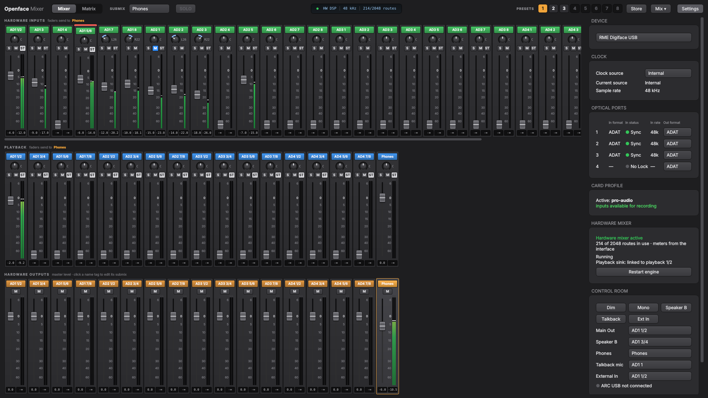
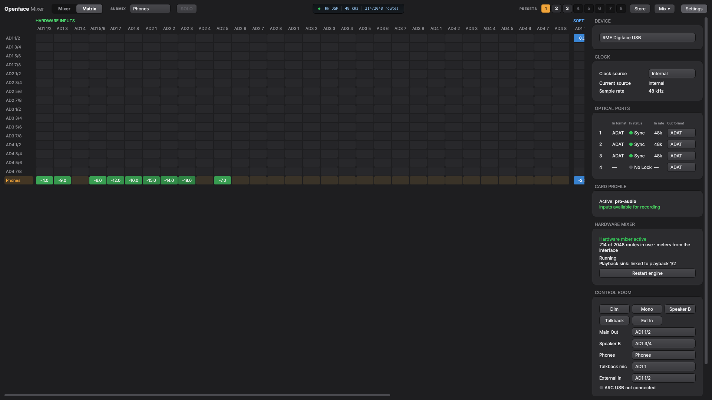

# Openface Mixer

A TotalMix-style mixer and control panel for the **RME Digiface USB** and the
**RME Fireface 802** (FireWire) on Linux.



RME's TotalMix FX only runs on Windows and macOS. Linux streams audio to both interfaces
(`snd-usb-audio` for the Digiface since kernel 6.12, `snd-fireface` for the 802), but nothing
controlled their routing. Openface Mixer drives the interface's own DSP mixer, over USB on the
Digiface and over FireWire on the 802, with the familiar TotalMix workflow.

- **Mixer view:** Hardware Inputs, Playback and Hardware Outputs, one row each.
  Pick an output, and the input and playback faders set the submix sent to it.
- **Matrix view:** route any input or playback channel to any output with a click.
- **Presets:** 8 snapshot slots, like TotalMix, plus export and import of mixes as files.
- **Fader groups:** 4 groups that move together relatively. Hold Shift to move one fader alone.
- **Channel strips:** compact, laid out like Pro Tools: name tag on top, pan with its value,
  solo, mute, stereo link, fader with its scale beside the peak meter, and level and peak
  readouts at the bottom. Output master faders below.
- **Solo like TotalMix:** solo-in-place, post fader, in the current submix only. The **SOLO**
  button in the top bar lights while anything is soloed and switches all solos off and back on.
- **Hardware panel:** clock source, ADAT or S/PDIF per optical port, and input lock/sync/rate status.
  On the Fireface 802 also the AES and optical options of TotalMix's settings dialog.
- **Channel settings (Fireface 802):** the ⚙ on each hardware input and output strip, like
  TotalMix's wrench: phase invert, 48V and Inst on AN 9–12, level and gain on AN 1–8.
- **Several interfaces:** pick the device in the settings panel. Each has its own mix, presets
  and engine, so a Digiface and an 802 can run side by side.
- **Always on:** the mix keeps running with the window closed. A small engine service restores
  it at login.

> **How mixing works:** Openface Mixer drives the Digiface's own DSP mixer over USB, like
> TotalMix, so input monitoring has no added latency and the mix keeps running in the
> interface even with the computer idle. There is no software mixing. See
> [docs/ARCHITECTURE.md](docs/ARCHITECTURE.md) and [docs/HARDWARE.md](docs/HARDWARE.md).

### Matrix view



## Requirements

- Linux 6.12 or newer (Digiface USB support in `snd-usb-audio`), or for the Fireface 802 a
  FireWire port and the `snd-fireface` driver (in the kernel since 5.x)
- PipeWire with WirePlumber
- Python 3.10+ with PySide6
- libusb 1.0 and udev rules for the Digiface and FireWire access (installed by `make install`)
- Build tools: a C compiler, `pkg-config`, and the libpipewire development headers
- `amixer` (alsa-utils) and `pactl` (libpulse)

On Arch / CachyOS:

```sh
sudo pacman -S --needed pyside6 libpipewire libusb alsa-utils libpulse gcc pkgconf make
```

On Debian / Ubuntu:

```sh
sudo apt install python3-pyside6.qtwidgets libpipewire-0.3-dev libusb-1.0-0-dev alsa-utils pulseaudio-utils build-essential pkg-config
```

## Install

```sh
git clone https://github.com/thomas-nelson23/Openface-Mixer.git
cd Openface-Mixer
make install
```

This installs to `~/.local`, adds **Openface Mixer** to your app menu, and enables the
`openface-mixer-engine` user service. Remove it with `make uninstall`.

## First run

1. Open **Openface Mixer**.
2. Monitoring works in any PipeWire profile, because the mix happens in the interface. To
   *record* all 32 inputs in apps, switch the Digiface to the **Pro Audio** profile: click
   *Record all inputs* in the settings panel, or pick the profile in your sound settings.
3. To send desktop audio through the mixer, select **Openface Mixer Playback** as your output
   device. It feeds playback channels 1/2. Send other apps or a DAW to the Digiface's own output
   channels (playback channel *n* = Digiface output *n*) with qpwgraph or Helvum.
4. Click an output's name tag (bottom row) to select its submix, then raise input and playback
   faders. Alternatively, click cells in the **Matrix** view.

### Controls

| Action | How |
| --- | --- |
| Fine fader move | Ctrl + drag (or Ctrl + scroll) |
| Fader to 0 dB | Double-click or Alt-click |
| Centre pan | Double-click the knob |
| Reset peak / clip | Click the meter |
| Solo | **S** on a strip: solo-in-place in the current submix. **SOLO** (top bar) switches all solos off, and back on |
| Store a preset | Click **Store**, then a slot (or right-click a slot) |
| Recall a preset | Click a lit slot |
| Fader groups | Right-click a strip → *Fader group*. Hold Shift to move one fader alone. |
| Matrix | Click a cell to toggle 0 dB / off, scroll to adjust, right-click to clear |

### Control room and ARC USB

The **Control Room** box in the settings panel has TotalMix's monitoring switches. They act on
the output pair set as **Main Out** and are not part of presets:

| Switch | What it does |
| --- | --- |
| Dim | Lowers Main Out by 20 dB |
| Mono | Sums Main Out to mono |
| Speaker B | Sends the Main Out mix to the Speaker B pair instead, at the Main Out level |
| Talkback | Sends the talkback mic input to Phones, with the rest of the phones mix 20 dB down |
| Ext In | Replaces the Main Out mix with the External In input pair |

Plug in an **RME ARC USB** (into the computer, not the Digiface) and it works with the default
TotalMix layout printed on it:

- Rows 1 and 2: recall presets 1 to 8.
- Row 3: Mono, Phones (both phones keys), External Input.
- Bottom: Talkback (tap to latch, hold to talk), Speaker B, Dim.
- Encoder: Main Out volume in 0.5 dB steps, or Phones volume while a Phones key is lit.

Key LEDs follow the state. The ARC needs no driver or setup; the window must be open for it to
work.

### Fireface 802

Connect the 802 over **FireWire** (its USB port only works in Class Compliant mode, where the
mixer can't be controlled). Openface Mixer opens the connected interface, or pick it under
**Device** in the settings panel; `openface-mixer --device ff802` opens it directly. The first
time, the GUI starts and enables its engine (`openface-mixer-engine@ff802`), which then restores
the 802's mix at every login. Its playback sink is called **Openface Mixer Playback (Fireface
802)**.

Openface Mixer is the source of truth for the 802's DSP, as TotalMix is: when it connects it
sends the whole mix and all settings, and it switches the DSP's EQ, dynamics, low cut, auto level
and reverb/echo off, because it has no controls for them yet. Don't run
`snd-fireface-ctl-service` alongside it.

## Files

| Path | Contents |
| --- | --- |
| `~/.config/openface-mixer/state.json` | Current mix and UI state (Digiface) |
| `~/.config/openface-mixer/presets.json` | The 8 preset slots (Digiface) |
| `~/.config/openface-mixer/matrix.bin` | Flattened gain matrix that the engine loads at startup (Digiface) |
| `~/.config/openface-mixer/ff802/` | The same three files for the Fireface 802, plus its settings |
| `~/.config/openface-mixer/device` | The device the GUI opened last |
| `~/.cache/openface-mixer/engine-<device>.log` | Engine log (only when started without systemd) |

## Development

```sh
make          # build the engine
make test     # unit tests (no hardware or display needed)
make run      # run the GUI from the source tree
make help     # list all targets
```

Read [CONTRIBUTING.md](CONTRIBUTING.md) and [docs/ARCHITECTURE.md](docs/ARCHITECTURE.md) first.
Hardware notes are in [docs/HARDWARE.md](docs/HARDWARE.md).

## Status and limitations

- The Digiface USB is only tested at 48 kHz (single speed). The UI is designed to adapt to
  2x/4x channel counts, but that path is untested.
- Fireface 802 support follows the protocol documented by snd-firewire-ctl-services and has
  not been checked on a unit yet (see [docs/HARDWARE.md](docs/HARDWARE.md#not-verified-on-hardware-yet)).
  It has no EQ, dynamics, auto level or reverb/echo controls yet; those DSP effects are
  switched off. The ARC USB's two phones keys both select PH 9/10.
- The hardware mixer allows 2048 active routes; the settings panel warns if a mix needs more.
- The mixer needs USB access to the Digiface (the udev rule installed by `make install`).
  Without it nothing is mixed, and the settings panel says why.
- Meters come from the interface itself: inputs, playback and the hardware outputs (post mix).
- Solo has no PFL / live mode or exclusive mode yet.
- No EQ, dynamics or reverb on the Digiface: its DSP has no effects.
- ARC USB: key assignments are fixed to TotalMix's default layout, and the footswitch is not
  supported (it sent nothing in testing).

## Acknowledgements

- **Asahi Lina** wrote the Digiface USB support in the Linux kernel and
  [rmectl](https://github.com/hoshinolina/rmectl). The USB protocol for the hardware mixer comes
  from those two; the level-meter format was decoded for this project
  (see [docs/HARDWARE.md](docs/HARDWARE.md)).
- **Takashi Sakamoto** wrote the kernel's `snd-fireface` driver and
  [snd-firewire-ctl-services](https://github.com/alsa-project/snd-firewire-ctl-services), whose
  Fireface 802 protocol code is where the 802's register and DSP command layout comes from.
- [oscmix](https://github.com/michaelforney/oscmix) by Michael Forney does the same job for the
  Fireface UCX II and was the model for controlling the interface's own mixer instead of mixing
  in software. It does not support the Digiface and none of its code or protocol is used here.

## License

MIT. See [LICENSE](LICENSE). Not affiliated with RME (Audio AG). "TotalMix", "Digiface" and
"Fireface" are trademarks of their respective owners.
